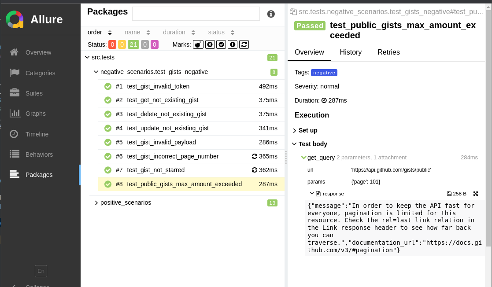

`Summary`

Gists provide a simple way to share code snippets with others. Every gist is a Git repository, which means that it can be forked and cloned

`Scope`

1. Functional verification testing of the SUT (System under test)
2. According to test pyramid there are: unit tests, integration tests and end-to-end tests
3. Unit tests is a dev area of responsibilities, so this is out of scope
4. Integration testing is a dev/qa area of responsibilities, but since we have only one service this is also out of scope
5. E2E testing is a qa area of responsibilities, this is the scope of a project

`Out of scope`

1. Performance testing
2. Security testing

`Goals and Deliverables`

1. Validate the SUT's feature set as specified, claimed, or otherwise made known to us
2. Provide regression testing
3. Document the test cases that we create to perform the feature validation: positive cases and negative cases
4. Produce evidence of our test coverage

`Test Approach`

1. The "feature set" under test is a service and network API. The requirements/specifications are focused on the JSON request and response bodies
2. Test cases and test runs will be recorded in Test management system (N/A, e.g. TestRail)
3. SUT specification will be recorded in the Issue tracker (N/A, e.g. Jira)
4. Test coverage will be demonstrated via Allure report

`Test Harness`

Custom framework (this repo)

`Test execution`

1. Go to this url: Jenkins service deployed in DigitalOcean
2. Run job (the job itself is parametrized, specify number of treads and confirm). Github has its own limitation on parallel query execution. Less than 4 should be fine
3. To see results click on allure icon close to job link on the Jenkins main page. It should look like this:

